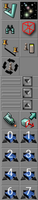
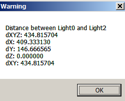

# EditorTools
Different tools for UnrealEditor 2.0/2.2

1. Align Camera on Selected Actor.
2. FaceDrag Mode.
3. 8 buttons for fast switch between Mover Key positions.
4. SkyBox1000Stars - make skybox with star sprites.
5. Distance - for measure distance.

6. EditActor - set some property to some value or show EditActor window. Similar to "Actor properties" window, but always stay on initial actor. Also contain category (Null/None) for vars without category.
7. Extruder - build brush which follow path defined by ClipMarkers.
8. BrushToCamera - Move builder Brush to first selected actor or in front of first Camera.
9. SearchActors - Search for Actors by different criteria. Allow search Event and Tags in custom fields, search by substring, by any property name, without case, filter world by search, search in search results, in specified class and so on.
10. RotateActor - Rotate selected actors to specified amount over one of axis.
